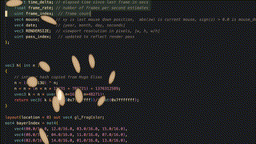

### Tweak Shader After Effects



This plugin allows you to run a shadertoy like glsl format in after effects. The glsl format is [documented here](https://github.com/mobile-bungalow/tweak_shader).

The plugins supports multiple render passes, any number of layer inputs, up to 32 total inputs of any kind, and renders 
at any bit depth. It builds for MacOs and Windows.

Future priorities include:
  * ci/cd for automatic releases
  * persistent buffers
  * vertex shaders 
  * sampling audio layers with optional FFT

This plugin is in early development: prepare for bugs and crashes, pull requests and collaboration are welcome. 


### Building

Download the after effects sdk for your desired platform and clone this repo into the `/Examples/Template` subdirectory.  

#### MacOs

note: If you downloaded your sdk from Adobe, You may have trouble opening `AfterEffectsSDK.dms`, rename it to `AfterEffecsSDK.dmg`.

download a compatible version of [cmake](https://cmake.org/download/) and [cargo](https://rustup.rs/). Then run the following.

```bash
mkdir build
cd build
cmake .. -G XCode
xcodebuild -configuration Release
```

The resulting `TWEAK_SHADER.plugin` will be inside the adjacent `Release` directory.

#### Windows

download a compatible version of [cmake](https://cmake.org/download/) and [cargo](https://rustup.rs/) and msvc through the Visual Studio Updater. Then run the following.

```powershell
mkdir build
cd build
cmake .. -G "Visual Studio 17 2022" 
& 'c:\Program Files\Microsoft Visual Studio\2022\Community\MSBuild\Current\Bin\MSBuild.exe' .\TWEAK_SHADER.sln
```
